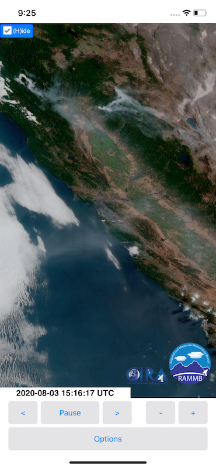

# Slider Mobile

A mobile app wrapper built with Xamarin.Forms for the [RAMMB/CIRA Slider](https://rammb-slider.cira.colostate.edu/) satellite imagery tool.

Platform |  |
---|-----|
iOS     | ✅
Android | ✅
UWP     | [Unsupported](https://github.com/jimmgarrido/slider-mobile/issues/1)

## Running the app
1. Open the `.sln` file in Visual Studio on Windows or Mac (must have Xamarin installed)
2. Set the Android or iOS project as start up
   1. For iOS, change the iOS Bundle Settings to your information 
3. Build and deploy the project

## Features
The Slider tool UI is difficult to use when viewing on a mobile device so this app lets you change some of the tool's settings using a native UI for a better experience.

